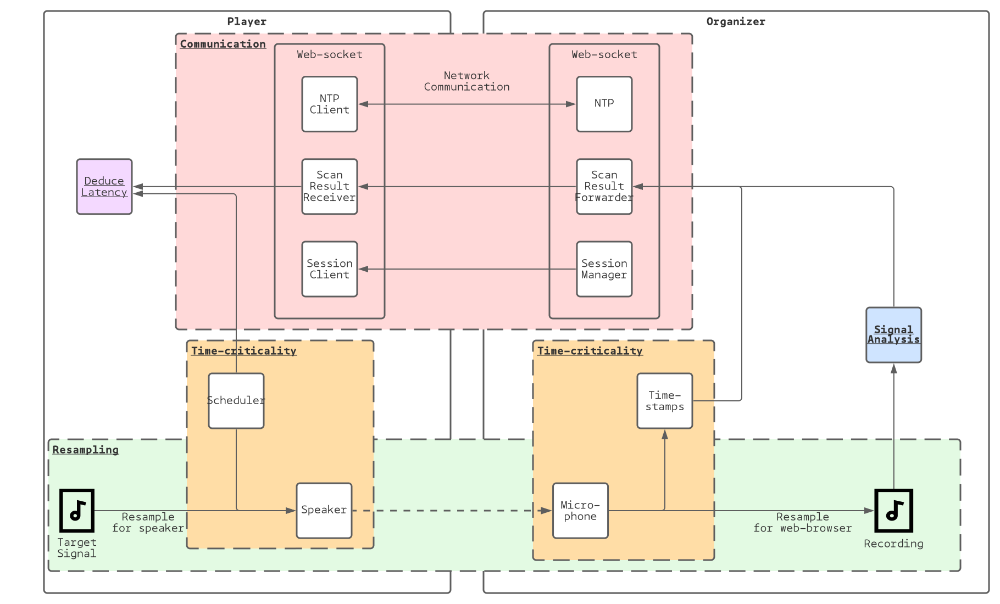

# Design

Alternative design solutions can be found under the [motivation](motivation.md).

## Design elements
In the schematic five elements are colored where they apply:
* Communication
* Signal analysis
* Time-criticality
* Deduce latency
* Resampling

## Central design elements
Two elements are central to the design:
* **Time-criticality**: Ensure precision in any derived result on audio output latency estimation.
  * **Signal scheduling**: Accuracy in audio playback is important to have certainty over audio actions timing.
  * **Input timestamping**: Accuracy in audio recording timestamps is important to have certainty on signal detection times.
* **Signal detection**: Recognition of target signals is essential in the process of deducing  latency.
  * **Signal analysis**: The signal analysis is necessary to find a target signal, and thus to recognize whether any speaker emitted a certain sound. It is a computative intense task.
  * **Signal loss**: Any loss from producing the target signal at a player to receiving it at the organizer. There are multiple causes, such as resampling, sampling, environmental noise, attenuation due to signal propagation, signal convolution due to reverbation, etcetera.

## Organizer-specific signal detection tests
The organizer performs various checks through out the process to ensure stability and correctness before playback can start.

| Test | Solution | Description |
| ---- |   ----   |    ----     |
| **Availability** of microphone device. | Check microphone hardware is available and provides mono input. | Organizer requires a microphone to sample its environment. |
| **Significance** of microphone input. | Check input has significant power density for analysis. | Microphone can be muted, or put very soft, or set very loud. By computing the power of the microphone, a lower and higher threshold to check for its significance. |
| **Correctness** of GPU-accelerated signal detection. | Perform GPU-accelerated cross-correlation and compare results against naive algorithm. | The organizing device requires (in current version) a GPU to have sufficiently fast signal detection execution. Some features are checked (like supporting floating-point texture buffers) and otherwise throw. Simply a unit test is performed to check the GPU computation matches a CPU computation. |
| **Minimizing** resampling | Target signal construction based on sampling rate of the microphone. | ... |

## Organizer-specific signal detection tests
| Test | Solution | Description |
| ---- |   ----   |    ----     |
| **Availability** of speaker device. | Check speaker hardware is available and provides mono output. | Player requires a speaker to play target signal and audio.  |
| **Significance** of speaker device. | ? | Speaker can be muted, or put very soft, or set very loud. |

## Shared Time-criticality tests

| Test | Solution | Description |
| ---- |   ----   |    ----     |
| **Time continuation** of audio-context time and performance time. | Continuously detect for abnormal deviations in audio-context time and performance time. | Discontinuity of the audio context internal timer occurs when the audio context is stopped (e.g. stopped by the operating system to spare resources, or stopped by the sound server due to competing audio applications for audio resources). Likewise discontinuity of the the performance time occurs when the JavaScript runtime is off-loaded (e.g. when switching browser tabs, switching application, closing the phone). If any of such events occur, the application has to be alerted that the current state has become invalid and new synchronization (or updates) are necessary. |
| **Time coherency** of audio-context timer. | Linearly regress sampled audio-context timer against the JavaScript runtime timer. | The internal time of the audio context can drift away (structurally) from the JavaScript runtime. This implies the number of audio samples processed per second does not accumulate to one second of audio time. We can assume JavaScript runtime time coherency. Therefore, by sampling we can deduce a linear pattern. |
| **Time consistency** of audio-context sampling. | Measure the deviation to predicted linear behavior. | As mentioned in [problems](docs/problems.md), any delayed handling of audio input (e.g. due to asynchronous behavior or a hanging CPU core) can introduce timing artifacts that end up as invalid timestamps used for audio analysis, rendering proper conclusions on this data to be inaccurate in reality. By consistently sampling the audio-context timer, we obtain its linear behavior. By extrapolating this behavior, we predict the expected time of new samples, in such we can find the error and thus deviation from uniform behavior. |
